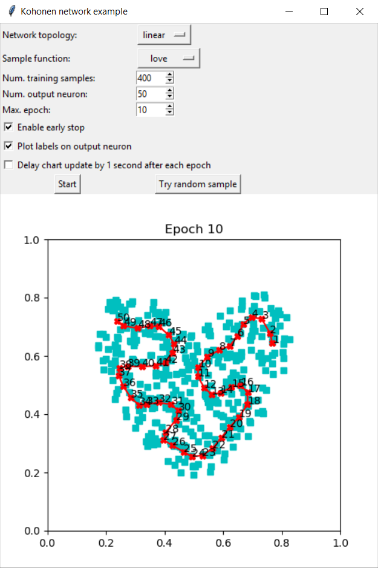

This repository contains an example of a Kohonen network implemented in Python (v 3.7.1).

The GUI allows to select some parameters, such as:
- The network topology of the output neurons map;
- The function from which the training samples will be sampled;
- The number of input samples and output neurons to be used;
- The number of epochs to be performed.

During the training phase the training samples and the output neurons are plotted, and after each epoch the output neurons are updated to show the training process. In the below image is shown how the GUI looks like.

